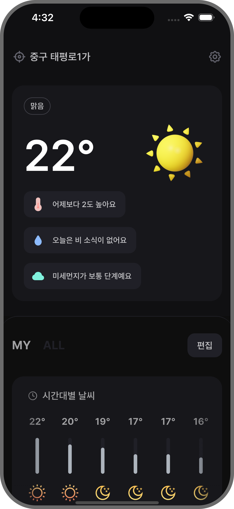
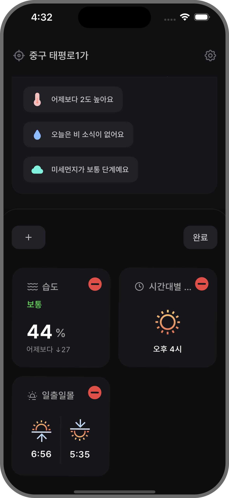
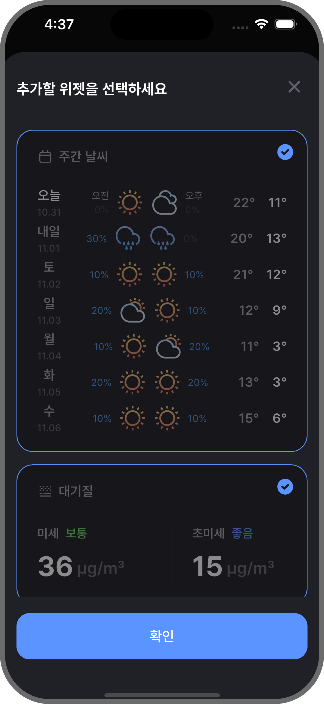
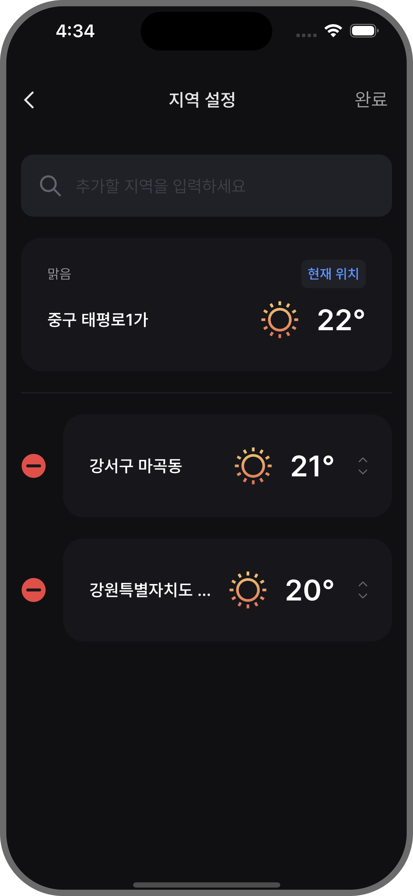

# Hey, Weather

[](https://github.com/jhk-im/hey_weather)
[](https://github.com/jhk-im)
[](https://opensource.org/licenses/MIT)

<p>  
  
  
  
  
</p>

<p>
  
  
  
  
</p>

</br>

## Tech Stack

- Flutter 3.24.3
- Dart 3.5.3
- DevTools 2.37.3
- [GetX](https://pub.dev/packages/get)
- [Hive](https://pub.dev/packages/hive)
- [Retrofit](https://pub.dev/packages/retrofit)

</br>

## Open API

`assets폴더에 .env파일을 추가하세요.`

```txt
WEATHER_SERVICE_KEY = '공공데이터 Service Key';
KAKAO_API_KEY = 'KAKAO API Key';
```

- [단기예보](https://www.data.go.kr/data/15084084/openapi.do)
- [중기예보](https://www.data.go.kr/data/15059468/openapi.do)
- [생활기상지수](https://www.data.go.kr/tcs/dss/selectApiDataDetailView.do?publicDataPk=15085288)
- [출몰시각정보](https://www.data.go.kr/tcs/dss/selectApiDataDetailView.do?publicDataPk=15012688)
- [대기오염정보](https://www.data.go.kr/tcs/dss/selectApiDataDetailView.do?publicDataPk=15073861)
- [Kakao주소검색](https://developers.kakao.com/docs/latest/ko/local/dev-guide)

</br>

## Build and Run
```zsh
git clone https://github.com/jhk-im/hey_weather.git
cd hey_weather
```

```zsh
flutter pub get
flutter pub run build_runner build 
```

</br>

## License

```txt
MIT License

Copyright (c) 2024 jhk

Permission is hereby granted, free of charge, to any person obtaining a copy
of this software and associated documentation files (the "Software"), to deal
in the Software without restriction, including without limitation the rights
to use, copy, modify, merge, publish, distribute, sublicense, and/or sell
copies of the Software, and to permit persons to whom the Software is
furnished to do so, subject to the following conditions:

The above copyright notice and this permission notice shall be included in all
copies or substantial portions of the Software.

THE SOFTWARE IS PROVIDED "AS IS", WITHOUT WARRANTY OF ANY KIND, EXPRESS OR
IMPLIED, INCLUDING BUT NOT LIMITED TO THE WARRANTIES OF MERCHANTABILITY,
FITNESS FOR A PARTICULAR PURPOSE AND NONINFRINGEMENT. IN NO EVENT SHALL THE
AUTHORS OR COPYRIGHT HOLDERS BE LIABLE FOR ANY CLAIM, DAMAGES OR OTHER
LIABILITY, WHETHER IN AN ACTION OF CONTRACT, TORT OR OTHERWISE, ARISING FROM,
OUT OF OR IN CONNECTION WITH THE SOFTWARE OR THE USE OR OTHER DEALINGS IN THE
SOFTWARE.
```